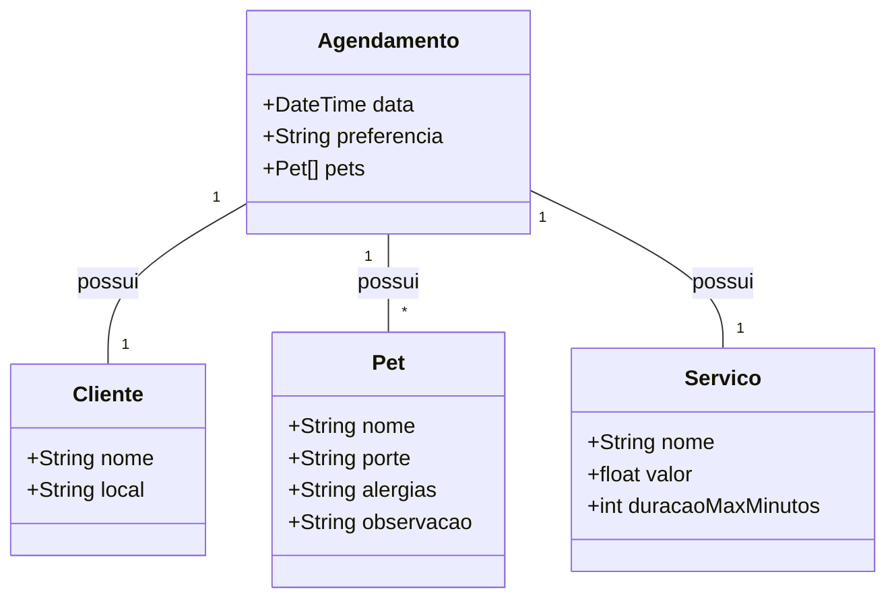

# Sistema para pets

## Dependencias

```json
"dependencies": {
    "body-parser": "^1.20.3",
    "express": "^4.21.2",
    "express-graphql": "^0.12.0",
    "graphql": "^15.10.1",
    "mongoose": "^8.11.0"
},
"devDependencies": {
    "nodemon": "^3.1.9"
}
```

## Diagrama


